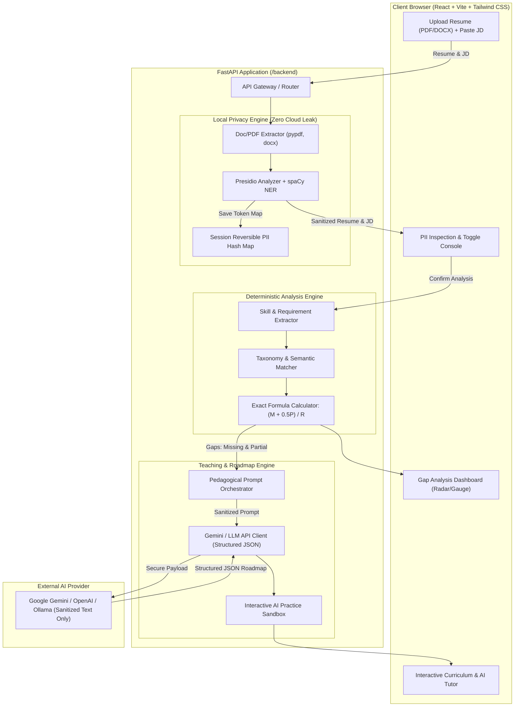
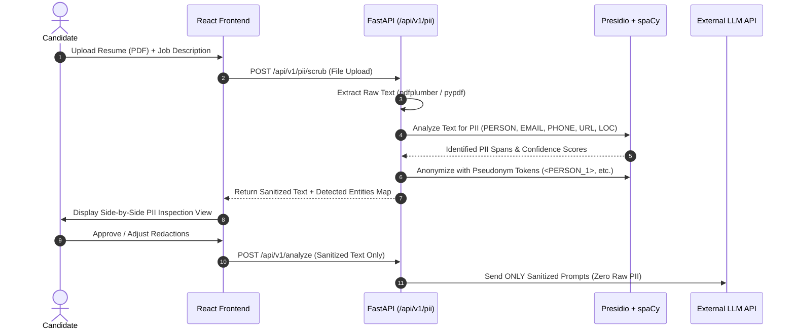

# ASTRIA: Architecture & Implementation Blueprint
### AI Resume Gap Analysis & Pedagogical Roadmap Platform

---

## 1. Executive Summary & Vision

**Astria** is an intelligent career acceleration platform designed to demystify job qualifications, pinpoint technical skill gaps with mathematical transparency, and construct personalized, interactive learning roadmaps. 

Unlike conventional "black-box" AI resume reviewers that output unpredictable ratings and transmit unscrubbed personal data to cloud providers, Astria is founded upon three inviolable pillars:

1. **Local Privacy Guarantee (Client/Edge PII Scrubbing)**: All Personally Identifiable Information (Names, Phone Numbers, Emails, Social Profiles, Physical Addresses, Identifiers) is sanitized on the local server using Microsoft Presidio and spaCy before any content reaches cloud LLMs.
2. **Deterministic & Explainable Gap Scoring**: Skill match scoring is strictly calculated using the mathematical formula:
   $$\text{Score} = \frac{\text{Matched} + 0.5 \times \text{Partial}}{\text{Total Required}} \times 100\%$$
   No arbitrary LLM hallucinations in the score calculation. Candidates receive a transparent, auditable breakdown.
3. **Actionable Pedagogical Engine**: Rather than merely listing missing proficiencies, Astria acts as a personal tutor—generating customized, milestone-based curriculum roadmaps with high-yield interview questions, real-world mini-projects, and an interactive tutoring dialogue.

---

## 2. High-Level Architecture

Astria employs a modern decoupled architecture:
- **Frontend**: React (Vite) + Tailwind CSS + Lucide Icons + Framer Motion (Glassmorphic, high-contrast dark mode).
- **Backend**: Python 3.11+ FastAPI + Pydantic v2 + Microsoft Presidio + spaCy + Google Gemini API (or OpenAI/Ollama compatible).



---

## 3. Core Subsystems Specification

### 3.1. Local PII Scrubbing Engine (Microsoft Presidio + spaCy)

#### Objective
Ensure zero candidate PII reaches external cloud LLMs while retaining contextual entity placeholders so the LLM understands roles, projects, and educational achievements without compromising privacy.

#### Architecture
- **Analyzer**: `presidio-analyzer` with the `en_core_web_lg` or `en_core_web_sm` spaCy language model.
- **Anonymizer**: `presidio-anonymizer` with configurable operators:
  - *Pseudonymization*: Replace `Jane Doe` with `<PERSON_1>`, `j.doe@example.com` with `<EMAIL_1>`, `+1-555-0199` with `<PHONE_1>`.
  - *Custom Recognizers*:
    - GitHub & LinkedIn profile links: Regex-based pattern recognizers.
    - Portfolio websites & personal domains.
    - Physical addresses & postal codes.
- **Reversibility Store**: An in-memory/session-scoped mapping table that maps `<TAG_ID>` back to original text exclusively for client-side rendering (never transmitted to third parties).

#### Scrubbing Flow


---

### 3.2. Deterministic Score Match Calculator

#### Objective
Provide an infallible, reproducible, mathematically proven match score that candidates can trust without unpredictable LLM score jitter.

#### Formula Definition
$$\text{Match Score (\%)} = \left( \frac{N_{\text{Matched}} + 0.5 \times N_{\text{Partial}}}{N_{\text{Required}}} \right) \times 100$$

Where:
- $N_{\text{Required}}$: Count of mandatory skills, technologies, and core qualifications extracted from the Job Description.
- $N_{\text{Matched}}$: Count of required skills directly verified in the candidate's resume (Weight = $1.0$).
- $N_{\text{Partial}}$: Count of required skills where the candidate possesses adjacent/transferable experience or junior-level exposure (Weight = $0.5$).
- $N_{\text{Missing}}$: Count of required skills completely absent (Weight = $0.0$).

#### Skill Match Categorization Matrix
| Category | Definition | Weight | Example |
| :--- | :--- | :--- | :--- |
| **Matched** | Direct keyword match, exact synonym, or equivalent framework proficiency verified in candidate projects/experience. | `1.0` | JD: "FastAPI, Python" <br> Resume: "3 yrs building async microservices in FastAPI and Python" |
| **Partial** | Adjacent stack, transferable paradigm, or junior experience where senior was specified. | `0.5` | JD: "PostgreSQL optimization" <br> Resume: "MySQL database design and indexing" <br>*or* JD: "React 18" <br> Resume: "Vue.js & Svelte" |
| **Missing** | Zero documented exposure or mention of the required skill or adjacent technologies. | `0.0` | JD: "Kubernetes cluster administration" <br> Resume: No container orchestration experience |
| **Bonus / Preferred** | Optional / "Nice to have" skills identified in JD. Does not penalize $N_{\text{Required}}$, but reported as supplementary boost indicators. | `+Bonus` | JD: "Bonus: Experience with WebSockets" |

#### Deterministic Edge Cases
1. **$N_{\text{Required}} = 0$**: If a generic JD contains no identifiable technical requirements, return `100%` with a warning code `NO_EXPLICIT_REQUIREMENTS`.
2. **Score Cap**: Maximum score is capped at `100.0%` (bonus skills are presented in a separate "Value-Add" metric).
3. **Rounding**: Scores rounded to one decimal place (e.g. `78.6%`).

---

### 3.3. LLM Roadmap & Pedagogical Engine

#### Objective
Transform identified gaps ($N_{\text{Missing}}$ and $N_{\text{Partial}}$) into a structured, progressive learning curriculum that equips the candidate to pass interviews and excel on the job.

#### Roadmap Structure (JSON Schema Output)
```json
{
  "summary": {
    "target_role": "Senior Backend Engineer",
    "overall_score": 68.5,
    "total_estimated_weeks": 4,
    "weekly_study_hours": 10
  },
  "skill_gap_breakdown": [
    {
      "skill": "Apache Kafka",
      "status": "MISSING",
      "severity": "CRITICAL",
      "reason": "Required for distributed event streaming"
    },
    {
      "skill": "Redis",
      "status": "PARTIAL",
      "severity": "MODERATE",
      "reason": "Resume shows basic caching; JD requires distributed locks and pub/sub"
    }
  ],
  "milestones": [
    {
      "week": 1,
      "theme": "Event-Driven Fundamentals & Kafka Core",
      "modules": [
        {
          "id": "mod-101",
          "title": "Kafka Architecture: Topics, Partitions & Consumer Groups",
          "core_concepts": ["Log retention", "Partition rebalancing", "Offset management"],
          "practical_project": {
            "title": "Build a Resilient Real-Time Order Streamer",
            "description": "Create a FastAPI producer and consumer with at-least-once delivery semantics.",
            "deliverable": "GitHub repository with docker-compose cluster"
          },
          "interview_prep": [
            {
              "question": "What happens when a consumer node fails during partition rebalance?",
              "expected_key_points": ["Coordinator election", "Heartbeat timeout", "Offset commit replay"]
            }
          ],
          "curated_resources": [
            {"title": "Kafka The Definitive Guide (Ch. 3)", "url": "https://kafka.apache.org/documentation/", "type": "DOCS"}
          ]
        }
      ]
    }
  ]
}
```

#### Interactive AI Tutor Mode
- Candidates can click on any milestone or skill chip to start a localized tutoring session.
- System prompt injects:
  - Sanitized candidate background context.
  - The target job expectation.
  - The specific missing/partial concept.
- The tutor uses the **Socratic method**: asks diagnostic questions, provides code review on mini-projects, and runs mock interview drills.

---

## 4. Repository & Directory Structure

```
astria/
├── .gitignore
├── README.md
├── PLAN.md                               # This blueprint
├── docker-compose.yml                    # Multi-container local orchestration
│
├── backend/                              # Python FastAPI Application
│   ├── Dockerfile
│   ├── requirements.txt
│   ├── pyproject.toml
│   ├── app/
│   │   ├── __init__.py
│   │   ├── main.py                       # FastAPI entrypoint, CORS, exception handlers
│   │   ├── core/
│   │   │   ├── config.py                 # Pydantic BaseSettings (API keys, models, log levels)
│   │   │   ├── logger.py                 # Structured logging
│   │   │   └── security.py               # Rate limiting, input validation
│   │   ├── api/
│   │   │   └── v1/
│   │   │       ├── __init__.py
│   │   │       ├── api_router.py         # Unified router
│   │   │       ├── endpoints/
│   │   │       │   ├── pii.py            # PII detection & anonymization endpoints
│   │   │       │   ├── analyze.py        # Gap analysis & deterministic scoring
│   │   │       │   ├── roadmap.py        # LLM curriculum generation
│   │   │       │   └── tutor.py          # Interactive AI tutor chat sessions
│   │   ├── services/
│   │   │   ├── pii_service.py            # Presidio Analyzer & Anonymizer wrapper
│   │   │   ├── doc_parser.py             # PDF & DOCX text extraction
│   │   │   ├── skill_extractor.py        # Entity extraction & JD requirement classification
│   │   │   ├── matcher_service.py        # Deterministic formula engine (M + 0.5P) / R
│   │   │   ├── llm_service.py            # LLM client abstraction (Gemini / OpenAI / Ollama)
│   │   │   └── roadmap_generator.py      # Prompt construction & structured output parsing
│   │   ├── schemas/
│   │   │   ├── pii_schema.py             # ScrubbedEntity, AnonymizeRequest/Response
│   │   │   ├── analysis_schema.py        # SkillClassification, MatchBreakdown, ScoreResponse
│   │   │   ├── roadmap_schema.py         # Module, Milestone, TeachingCurriculum
│   │   │   └── tutor_schema.py           # ChatMessage, TutorPrompt, FeedbackResponse
│   │   └── data/
│   │       ├── skill_taxonomy.json       # Canonical tech skills, aliases, and adjacency graph
│   │       └── test_samples/             # Synthetic resumes & JDs for verification
│   └── tests/
│       ├── test_pii.py                   # Verification of zero leakage on sensitive resumes
│       ├── test_scoring.py               # Unit tests for deterministic mathematical formula
│       ├── test_parser.py                # Test PDF/DOCX edge cases
│       └── test_roadmap.py               # LLM output validation against schema
│
└── frontend/                             # React (Vite) + Tailwind CSS Application
    ├── Dockerfile
    ├── package.json
    ├── vite.config.ts
    ├── tailwind.config.js
    ├── postcss.config.js
    ├── tsconfig.json
    ├── index.html
    └── src/
        ├── main.tsx
        ├── App.tsx                       # Router & Layout wrappers
        ├── index.css                     # Tailwind directives, dark theme tokens & scrollbars
        ├── assets/                       # Brand icons, illustrations, SVGs
        ├── types/
        │   ├── pii.ts
        │   ├── analysis.ts
        │   ├── roadmap.ts
        │   └── tutor.ts
        ├── services/
        │   ├── api.ts                    # Axios / Fetch client with typed endpoints
        │   └── mockData.ts               # Offline development fixtures
        ├── hooks/
        │   ├── useAnalyze.ts             # Orchestrates multi-step pipeline state
        │   ├── useTutor.ts               # Chat state & SSE streaming
        │   └── useTheme.ts               # Dark/Light mode switcher
        ├── components/
        │   ├── common/
        │   │   ├── Navbar.tsx            # Header with navigation & status
        │   │   ├── Button.tsx            # Reusable button with loading & icon variants
        │   │   ├── Card.tsx              # Glassmorphic container with neon borders
        │   │   ├── Badge.tsx             # Matched (green), Partial (amber), Missing (red)
        │   │   ├── ProgressBar.tsx       # Animated score gauge & progress track
        │   │   └── Modal.tsx
        │   ├── upload/
        │   │   ├── ResumeDropzone.tsx    # Drag-and-drop PDF/DOCX uploader
        │   │   ├── JobDescInput.tsx      # Textarea with auto-detection & sample presets
        │   │   └── PipelineStepper.tsx   # Visual indicator: Upload -> Privacy -> Score -> Learn
        │   ├── privacy/
        │   │   ├── PIIScrubberView.tsx   # Side-by-side original vs scrubbed text diff
        │   │   ├── EntityTagList.tsx     # Found PII entities list with toggle switches
        │   │   └── PrivacyBadge.tsx      # Explanatory security guarantee tag
        │   ├── analysis/
        │   │   ├── ScoreRadialGauge.tsx  # Dynamic SVG circular radial chart for (M+0.5P)/R
        │   │   ├── SkillBreakdown.tsx    # Filterable categorized list of skills
        │   │   ├── MatchAuditTable.tsx   # Line-item audit of exact formula calculation
        │   │   └── StrengthWeakness.tsx  # Quick summary cards
        │   ├── roadmap/
        │   │   ├── RoadmapTimeline.tsx   # Milestone timeline with week-by-week expansion
        │   │   ├── ModuleCard.tsx        # Card with concepts, deliverables, and interview tips
        │   │   └── ProjectDetailsModal.tsx # Full-screen project deliverable guide
        │   └── tutor/
        │       ├── TutorChatWindow.tsx   # Real-time chat interface with AI mentor
        │       ├── InterviewQuizCard.tsx # Interactive multiple-choice / flashcard quiz
        │       └── CodeSandboxStub.tsx   # Markdown syntax-highlighted code practice area
        └── pages/
            ├── LandingPage.tsx           # Hero section, feature preview, value props
            ├── AnalyzePage.tsx           # Upload & PII verification stage
            ├── DashboardPage.tsx         # Gap score visualizer & detailed audit
            └── RoadmapPage.tsx           # Curriculum view & interactive tutor
```

---

## 5. API Specification & Data Contracts

### 5.1. PII Scrubbing API
#### `POST /api/v1/pii/scrub`
Accepts a multipart file upload (resume) and optional job description text. Returns redacted/pseudonymized text and identified entity spans.

**Request**:
```http
POST /api/v1/pii/scrub
Content-Type: multipart/form-data

file: <binary resume.pdf>
job_description: "Senior Python Engineer required..." (optional)
anonymize_mode: "pseudonymize" | "redact"
```

**Response**:
```json
{
  "status": "success",
  "document_id": "doc_8f43b1a2",
  "original_char_count": 3420,
  "sanitized_char_count": 3215,
  "sanitized_resume_text": "Experienced software developer <PERSON_1> with 5 years building backend APIs. Contact: <EMAIL_1>...",
  "sanitized_job_description": "Senior Python Engineer required...",
  "detected_entities": [
    {
      "entity_type": "PERSON",
      "original_value": "Jane Doe",
      "placeholder": "<PERSON_1>",
      "start": 32,
      "end": 40,
      "confidence": 0.94
    },
    {
      "entity_type": "EMAIL_ADDRESS",
      "original_value": "jane.doe@example.com",
      "placeholder": "<EMAIL_1>",
      "start": 120,
      "end": 140,
      "confidence": 0.99
    }
  ]
}
```

---

### 5.2. Gap Analysis & Deterministic Scoring API
#### `POST /api/v1/analyze`
Takes the sanitized resume text and job description, extracts requirements, classifies skills into Matched, Partial, and Missing, and calculates the exact score.

**Request**:
```json
{
  "document_id": "doc_8f43b1a2",
  "sanitized_resume_text": "Experienced software developer <PERSON_1> with Python, FastAPI, and MySQL...",
  "sanitized_job_description": "Looking for a Senior Python Developer with FastAPI, PostgreSQL, and Kubernetes experience."
}
```

**Response**:
```json
{
  "summary": {
    "score_percentage": 50.0,
    "formula_applied": "(Matched + 0.5 * Partial) / Required",
    "required_count": 3,
    "matched_count": 1,
    "partial_count": 1,
    "missing_count": 1,
    "bonus_count": 0
  },
  "categorized_skills": [
    {
      "skill_name": "FastAPI",
      "status": "MATCHED",
      "weight": 1.0,
      "candidate_evidence": "Mentioned 4 times across 2 projects",
      "required_level": "High",
      "candidate_level": "High"
    },
    {
      "skill_name": "PostgreSQL",
      "status": "PARTIAL",
      "weight": 0.5,
      "candidate_evidence": "Candidate has strong MySQL experience (adjacent relational DB)",
      "gap_notes": "Needs PostgreSQL-specific concepts: MVCC, VACUUM, JSONB indexing"
    },
    {
      "skill_name": "Kubernetes",
      "status": "MISSING",
      "weight": 0.0,
      "candidate_evidence": null,
      "gap_notes": "No container orchestration found on resume"
    }
  ],
  "calculation_audit": {
    "numerator": "1 + (0.5 * 1) = 1.5",
    "denominator": "3",
    "raw_fraction": 0.5,
    "display_score": "50.0%"
  }
}
```

---

### 5.3. LLM Roadmap Generation API
#### `POST /api/v1/roadmap/generate`
Generates an actionable, milestone-driven curriculum based exclusively on the missing and partial skills.

**Request**:
```json
{
  "document_id": "doc_8f43b1a2",
  "target_role": "Senior Python Developer",
  "matched_skills": ["FastAPI", "Python"],
  "partial_skills": [{"name": "PostgreSQL", "context": "Knows MySQL"}],
  "missing_skills": ["Kubernetes"],
  "target_timeline_weeks": 4
}
```

**Response**: Returns the structured `TeachingCurriculum` JSON detailed in Section 3.3.

---

### 5.4. Interactive AI Tutor API
#### `POST /api/v1/tutor/chat`
Enables the candidate to practice specific skills with an AI coach.

**Request**:
```json
{
  "module_id": "mod-101",
  "skill_focus": "Kubernetes Pod Scheduling",
  "messages": [
    {"role": "user", "content": "How do NodeAffinity and Taints/Tolerations interact?"}
  ]
}
```

**Response**:
```json
{
  "reply": "Think of Taints as a repellent and NodeAffinity as an attraction. A node with a Taint says 'Keep away unless you tolerate me', whereas NodeAffinity says 'I prefer or require being placed on nodes with these labels'...",
  "follow_up_quiz": {
    "question": "If a Node has a NoSchedule taint and a Pod has matching NodeAffinity but NO toleration, will it schedule?",
    "options": ["Yes", "No", "Only if cluster is full"],
    "correct_answer_index": 1,
    "explanation": "No. Tolerations are strictly required to overcome a NoSchedule taint, regardless of affinity."
  }
}
```

---

## 6. Frontend UI/UX Design System

### 6.1. Visual Theme & Aesthetics
- **Color Palette**:
  - Background: Obsidian Slate (`#0B0F17`) and Deep Navy (`#111827`)
  - Surface Glass: `rgba(17, 24, 39, 0.75)` with `backdrop-blur-md` and subtle border `rgba(255, 255, 255, 0.08)`
  - Accent / Primary: Cosmic Violet (`#8B5CF6`) & Electric Indigo (`#6366F1`)
  - Status Indicators:
    - **Matched**: Emerald Green (`#10B981` / `bg-emerald-950/40 text-emerald-400 border-emerald-500/30`)
    - **Partial**: Radiant Amber (`#F59E0B` / `bg-amber-950/40 text-amber-400 border-amber-500/30`)
    - **Missing**: Crimson Coral (`#EF4444` / `bg-rose-950/40 text-rose-400 border-rose-500/30`)
- **Typography**: Clean, technical modern sans-serif (`Inter` or `Plus Jakarta Sans`) with monospaced code blocks (`JetBrains Mono`).

### 6.2. Key Screen Workflows

```
┌────────────────────────────────────────────────────────────────────────┐
│ 1. UPLOAD & TARGET                                                     │
│ ┌───────────────────────────┐      ┌─────────────────────────────────┐ │
│ │  Drag & Drop Resume (PDF) │  +   │ Paste Target Job Description    │ │
│ └───────────────────────────┘      └─────────────────────────────────┘ │
└───────────────────────────────────┬────────────────────────────────────┘
                                    │
                                    ▼
┌────────────────────────────────────────────────────────────────────────┐
│ 2. PRIVACY & PII SCRUBBER INSPECTION                                   │
│ "Zero raw candidate data leaves this machine. Review sanitized tags:"  │
│ [x] <PERSON_1> [x] <EMAIL_1> [x] <PHONE_1> [x] <GITHUB_URL>           │
│ [ Proceed to Gap Analysis -> ]                                         │
└───────────────────────────────────┬────────────────────────────────────┘
                                    │
                                    ▼
┌────────────────────────────────────────────────────────────────────────┐
│ 3. DETERMINISTIC GAP SCORE DASHBOARD                                   │
│ ┌──────────────────────┐  ┌──────────────────────────────────────────┐ │
│ │   (M + 0.5P) / R     │  │  MATCHED (1): FastAPI [1.0]              │ │
│ │        75%           │  │  PARTIAL (1): PostgreSQL [0.5] (Knows SQL)│ │
│ │  Formula Verified    │  │  MISSING (1): Kubernetes [0.0]           │ │
│ └──────────────────────┘  └──────────────────────────────────────────┘ │
│ [ Generate 4-Week Pedagogical Roadmap -> ]                             │
└───────────────────────────────────┬────────────────────────────────────┘
                                    │
                                    ▼
┌────────────────────────────────────────────────────────────────────────┐
│ 4. INTERACTIVE TEACHING ROADMAP & TUTOR                                │
│ Week 1: PostgreSQL Advanced Optimization (MVCC, Indexing, EXPLAIN)     │
│  ├─ [Hands-on Mini Project: Indexing 1M Rows]                          │
│  ├─ [Top 5 Interview Pitfalls & Traps]                                 │
│  └─ [Start AI Practice Sandbox / Quiz]                                 │
│ Week 2: Kubernetes Fundamentals for Backend Engineers                  │
└────────────────────────────────────────────────────────────────────────┘
```

---

## 7. Implementation Milestones & Operational Status

| Milestone Subsystem | Implementation Details | Verification Status |
| :--- | :--- | :--- |
| **1. Local PII Scrubber** | Microsoft Presidio + spaCy NER with deterministic regex fallback. Non-overlapping span resolution, reverse-offset slice replacement, and length-ordered collision-free restoration. | **Complete & Verified** (`test_pii_scrubber`) |
| **2. Deterministic ATS Matcher** | Exact formula: $\text{Score} = \frac{M + 0.5P}{R} \times 100\%$. Context-aware disambiguation preventing false positives for `go`, `react`, `rest`, `js`, with symbol boundaries for `c++`, `c#`, `ci/cd`, `.net`. | **Complete & Verified** (`test_match_engine`) |
| **3. Multi-Format Doc Ingestion** | Native zero-dependency DOCX text parser (`zipfile` + `xml.etree.ElementTree`) + PDF text extraction (`pypdf`). | **Complete & Verified** (`test_docx_parser`) |
| **4. Pedagogical LLM Service** | Dual-provider support for Google Gemini (`gemini-1.5-flash`) & OpenAI (`gpt-4o-mini`) with automatic markdown code-fence cleaner (`clean_json_response`) and zero-config offline fallback. | **Complete & Verified** (`test_llm_services`) |
| **5. Socratic AI Tutor Sandbox** | Interactive frontend modal (`AITutorSandbox.jsx`) connected to `/api/tutor/chat` featuring real-time pedagogical dialogue, Socratic starters, and 4-option adaptive diagnostic quizzes. | **Complete & Verified** (`npm run build`) |
| **6. Frontend Glassmorphic UI** | 5 core views: Target Role Configurator, Self-Assessment Matrix, Privacy Gap Analysis, Interactive Roadmap, and ATS Bullets. | **Complete & Verified** (0 build errors) |

---

## 8. Verification & Test Suite Summary

The automated test suite (`backend/test_backend.py`) validates system correctness:

```bash
# Execute automated backend verification
cd backend
python test_backend.py
```

### Verified Test Cases:
1. **PII Email Sentence Boundary**: Ensures trailing sentence periods (e.g. `jane@example.com.`) are never swallowed into replacement tokens.
2. **PII Safe Unscrubbing**: Ensures `<PERSON_1>` and `<PERSON_10>` do not collide during restoration pass.
3. **False-Positive Prevention**:
   - `"We go above and beyond"` $\rightarrow$ `go` is NOT extracted.
   - `"Ability to react quickly"` $\rightarrow$ `react` is NOT extracted.
   - `"The rest of the team"` $\rightarrow$ `rest` is NOT extracted.
   - `"Built with Next.js and Vue.js"` $\rightarrow$ `javascript` is NOT falsely extracted; `next.js` and `vue` match cleanly.
4. **Symbolic Tech Extraction**: Correctly extracts `c++`, `ci/cd`, `c#`, `go`, `react`, and `rest`.
5. **DOCX Ingestion**: Decompresses and extracts XML paragraphs from docx buffers without external dependencies.
6. **AI Tutor Chat & Roadmap**: Generates structured JSON adhering to Pydantic schemas.

---

## 9. Quick Start & Execution Runbook

### Prerequisites
- Node.js 18+ and npm
- Python 3.10+ (virtualenv recommended)

### Step 1: Start Backend API
```bash
cd backend
python -m venv .venv
# On Windows:
.venv\Scripts\activate
# On Linux/macOS:
# source .venv/bin/activate

pip install -r requirements.txt
python main.py
# Server runs on http://localhost:8000 (Docs at /docs)
```

### Step 2: Start Frontend Application
```bash
cd frontend
npm install
npm run dev
# Frontend runs on http://localhost:5173
```

### Step 3: Run Full Backend Verification
```bash
cd backend
python test_backend.py
```

