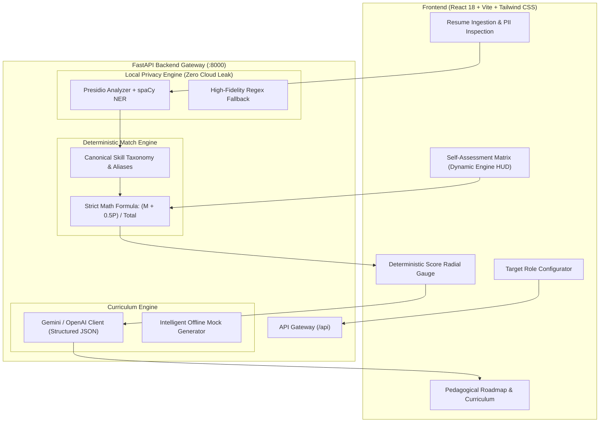

# Astria ⚡
### Privacy-First AI Resume Gap Analysis & Pedagogical Roadmap Platform

[](https://fastapi.tiangolo.com)
[](https://react.dev)
[](https://vitejs.dev)
[](https://tailwindcss.com)
[](https://python.org)
[](https://github.com/microsoft/presidio)

---

## 🌟 Overview

**Astria** is a modern, transparent career acceleration platform that analyzes job qualifications, pinpoints technical skill gaps with **mathematical precision**, and builds personalized, week-by-week technical curriculums.

Unlike conventional "black-box" AI resume tools that transmit unscrubbed candidate records to cloud LLMs, Astria is founded upon three core pillars:

1. **Zero Cloud Leak (Edge/Local PII Scrubbing)**: All Personally Identifiable Information (Names, Phone Numbers, Emails, Social Profiles, Addresses, and Identifiers) is sanitized locally using Microsoft Presidio and spaCy before any content reaches cloud LLMs.
2. **Deterministic & Explainable ATS Gap Scoring**: Match fit is calculated using the exact formula:
   $$\text{ATS Score (\%)} = \left( \frac{\text{Matched} + 0.5 \times \text{Partial}}{\text{Total Required}} \right) \times 100$$
   Zero hallucinations in the score calculation. Candidates receive a transparent, auditable breakdown.
3. **Actionable Pedagogical Engine**: Rather than generic advice, Astria generates milestone-based curriculum roadmaps with hands-on mini projects, high-yield interview questions, and tailored ATS resume bullets.

---

## 🖥️ Modern Dark-Mode SaaS Interface

- **Target Role Configurator**: Enter your target job title and job description, or load industry standard presets (*Senior Backend Engineer*, *Full Stack Architect*, *Cloud/DevOps Engineer*, *AI/LLM Systems Engineer*). Includes real-time requirement extraction.
- **Self-Assessment Matrix**: List known languages, frameworks, and databases, and assign confidence levels (*Beginner*, *Intermediate*, *Expert*). The deterministic match engine recalculates your score and formula live in real-time.
- **ATS Gap Analysis Dashboard**: Radial SVG gauge with audit expressions, interactive skill badges, and PII redaction inspection.
- **Weekly Learning Roadmap**: Week-by-week sprints, hands-on portfolio deliverables, and common interview pitfalls.
- **ATS Resume Tailor**: Generates high-impact resume bullet points framing transferable technical exposure into target role competencies.

---

## 🏛️ Architecture & Data Flow



---

## 🚀 Quick Start

### Option A: One-Click Launch (Recommended)

Simply double-click or run:
```cmd
run_app.bat
```
This automatically boots both:
- **FastAPI Backend** on [http://localhost:8000](http://localhost:8000)
- **Vite React Frontend** on [http://localhost:5173](http://localhost:5173)

---

### Option B: Manual Setup

#### 1. Backend Setup
```powershell
cd backend
python -m venv .venv
.\.venv\Scripts\Activate.ps1
pip install -r requirements.txt
python -m spacy download en_core_web_sm
python -m uvicorn main:app --host 0.0.0.0 --port 8000 --reload
```

#### 2. Frontend Setup
```powershell
cd frontend
npm install
npm run dev
```

---

## 🧪 Testing & Verification

Run the comprehensive verification test suite:
```powershell
cd backend
.\.venv\Scripts\python.exe test_backend.py
```

This verifies:
1. **PII Scrubber**: Redaction of personal names, emails, phone numbers, and profile URLs.
2. **Match Engine**: Exact mathematical floating precision of the scoring formula $(M + 0.5P) / R$.
3. **LLM Roadmap Generator**: Schema conformity of generated milestone curriculums.

---

## 🔒 Privacy Guarantee

Astria guarantees that **no candidate personal identifiable information (PII) leaves your local machine**. Presidio and spaCy sanitize text at the boundary before any prompts are transmitted to cloud AI providers.

---

## 📄 License
MIT License © 2026 Astria Platform.
